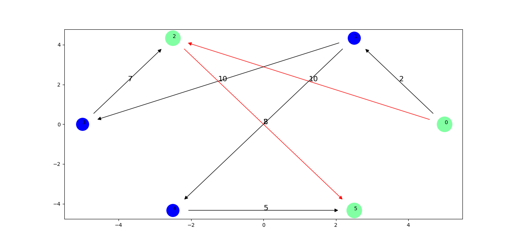

# Graphnet
[](https://pypi.org/project/pygnet/)

A lightweight python library for graph and networks manipulation and visualization

# Installation
```bash
pip install graphnet
```

# Usage
```python
>>> from graphnet import Graph
>>> g = Graph()
>>> g.add_node(1)
>>> g.add_node(2)
>>> g.add_node(3)
>>> g.add_edge(1,2)
>>> g.add_edge(2, 3)
>>> g.graph_matrix
array([[0., 1., 0.],
       [1., 0., 1.],
       [0., 1., 0.]])
```
The node object can take any hashable object as input in this example we use integers for simplicity but you can use any object of your choice. The are two graph types supported for now, The are `vector` and `scalar` type graphs. Graph objects by default are scalar or undirected graph to change it's type assign the variable `VECTOR` to the Graph type argument like so.

```python
>>> from graphnet import VECTOR
>>> g = Graph(type=VECTOR)
```
## Visualizing
Graphnet supports graph visualization through [Matplotlib](https://matplotlib.org/) API. All the graph plot heavy-lifting is done by one method so the is no need to worry. customization can be done using the display method parameters.

```python
>>> from graphnet import VECTOR
>>> import matplotlib.pyplot as plt
>>> g = Graph(type=VECTOR)
>>> g.add_node(1)
>>> g.add_node(2)
>>> g.add_node(3)
>>> g.add_node(4)
>>> g.add_edge(1,2,weight=2)
>>> g.add_edge(2,3,weight=6)
>>> g.add_edge(3,4,weight=0)
>>> g.add_edge(4,1,weight=4)
>>> g.display(weighted=True)
>>> plt.show()
```


Nodes and Edges can be added through iterable to reduce code lines and to load data from a huge iterable.

```python
>>> g = Graph()
>>> g.add_nodes_from_iterable(range(5))
>>> edge_list = [(1,2,3), (3,4), (0,1,2), (2,4), (3,2,1), (4,2,0)]
>>> g.add_edges_from_iterable(edge_list)
>>> g.graph_matrix
array([[0., 2., 0., 0., 0.],
       [2., 0., 3., 0., 0.],
       [0., 3., 0., 1., 0.],
       [0., 0., 1., 0., 1.],
       [0., 0., 0., 1., 0.]])
```
Data can also be added to the graph from dictionaries.

```python
>>> h = Graph(type=VECTOR)
>>> m = {1:[1,2], 2:[3], 3:[4,1], 4:[2]}
>>> h.from_dict(m)
>>> h.graph_matrix
array([[1., 1., 0., 0.],
       [0., 0., 1., 0.],
       [1., 0., 0., 1.],
       [0., 1., 0., 0.]])
```

## Using Custom Node Class
In some cases you might want to use a custom class as nodes in the graph to create networks. to use custom node class in the graph first we inherit from the Node class and then overwrite the `__eq__`,`__hash__`,`__repr__` methods in other for the custom class to work well with the graph. then pass the new reference attribute to the graph or you can use the old reference `value`.

```python
class Person(Node):
    def __init__(self, name, age, sex):
        Node.__init__(self)
        self.name = name
        self.age = age
        self.sex = sex
    
    def __eq__(self, other):
        return self.name == other.name

    def __hash__(self):
        return hash(self.name)

    def __repr__(self):
        return "Person(name=%s, age=%s, sex=%s)"%(self.name, self.age, self.sex)

g = Graph(ref="name")
```

## Algorithms
The algorithms module supports only two algorithms for now.

+ [Dijkstra Algorithm](https://en.wikipedia.org/wiki/Dijkstra%27s_algorithm)
+ [Minimum Spanning Tree](https://en.wikipedia.org/wiki/Minimum_spanning_tree) 
```python
from graphnet.algorithms import dijkstra

with Graph(type='vector') as g:
    for i in range(6):
        g.add_node(Node(i))
    edges = [(0, 1, 2), (0, 2, 10), (1, 3, 10),
                (1, 4, 8), (2, 5, 2), (3, 2, 7), (4, 5, 5)]
    for e in edges:
        g.add_edge(*e)
    cost = dijkstra(g, 0, 5, path=True)
    for i, c in enumerate(cost):
        if i < len(cost)-1:
            edge = g.connections[g.get_node_id(
                cost[i])][g.get_node_id(cost[i+1])]
        c.color = "#82ffa3"
        edge.color= 'red'
        c.radius = 0.2
    g.display(weighted=True)
    plt.show()
```


# Dependencies
1. Numpy
2. Matplotlib

# Contributing
Any pull requests to this projects will be reviewed and accepted as long as you follow the Contributing Guide. 

# License

This project is licensed under the MIT License, see the [LICENSE](https://github.com/Fredpwol/graphnet/blob/master/LICENSE) file for details.